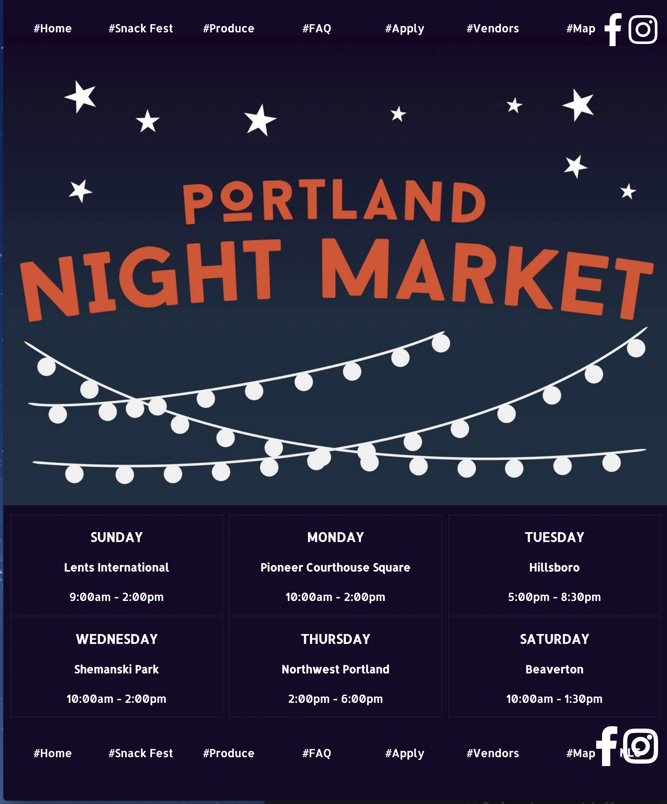

# _Portland Night Marking Redesign _

#### _Update Portland Night Market for a sleeker experience using React, April 25, 2019_

#### By _**Nelia Terrazas, Victoria Martinez, Dino Nguyen, Nayomi Morita, Gary Bermudez, Isaac Hall **_

## Description
Current Portland Night Market site (04/25/19)

Updated Home Page (04/25/2019)

## Setup/Installation Requirements

* Download this repository at https://github.com/neliaterrazas/portland-night-market.git onto your Desktop.
* Run $ npm i to download package.json .
* $ npm run start to display on your preferred local web browser.

## Known Bugs

_{Are there issues that have not yet been resolved that you want to let users know you know?  Outline any issues that would impact use of your application.  Share any workarounds that are in place. }_

## Support and contact details
Contact Nelia Terrazas at terrazasnelia@gmail.com

## Technologies Used
React

### License
*MIT*

Copyright (c) 2019 **_Nelia Terrazas_**
